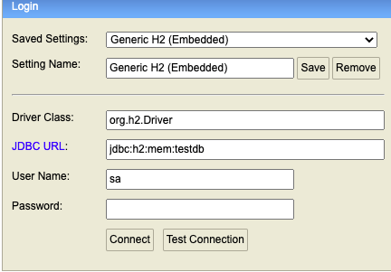

<div align="center" id="top"> 
  
  &#xa0;

  <!-- <a href="https://filme.netlify.app">Demo</a> -->
</div>

<h1 align="center">Filme API REST - Sprint Boot</h1>

<p align="center">
  

  

  

  <!-- -->

   
</p>

<!-- Status -->

<!-- <h4 align="center"> 
	🚧  Filme 🚀 Under construction...  🚧
</h4> 

<hr> -->

<p align="center">
  <a href="#dart-about">Sobre</a> &#xa0; | &#xa0; 
  <a href="#sparkles-features">Recursos</a> &#xa0; | &#xa0;
  <a href="#rocket-technologies">Tecnologias</a> &#xa0; | &#xa0;
  <a href="#white_check_mark-requirements">Requisitos</a> &#xa0; | &#xa0;
  <a href="#checkered_flag-starting">Iniciando</a> &#xa0; | &#xa0;
  <a href="https://github.com/monteironascimento" target="_blank">Monteiro</a>
</p>


<br>
 
## :dart: Sobre ##

Projeto Desenvolvido, Backend CRUD de informações de Filmes, com base em planilha pré carregada no inicialização da aplicação.


## :sparkles: Recursos ##

:heavy_check_mark: Objetivo consultar os dois produtores com maior intervalo de premiãção entre seus filmes. 
:heavy_check_mark: - Objetivo consultar os dois produtores com menor intervalo de premiãção entre seus filmes. 1;

## :rocket: Tecnologias ##

The following tools were used in this project:

- [Git](https://git-scm.com)
- [OpenJdk-17](https://openjdk.java.net/projects/jdk/17/)
- [ApacheMaven](https://maven.apache.org/)
- [Database-H2](https://www.h2database.com/)
- [Spring Boot](https://spring.io/guides)

## :white_check_mark: Requisitos ##

Before starting :checkered_flag:, você precisa ter o [Git](https://git-scm.com), [OpenJdk-17](https://openjdk.java.net/projects/jdk/17/) e o [Maven](https://maven.apache.org/) instalados.

## :checkered_flag: Iniciando ##

```bash
# Clonar o Projeto do repositório do GIT.
$ git clone https://github.com/monteironascimento/filme

# Acessar
$ cd filme

# Teste de integração continua
$ mvn clean integration-test

# Executar o Projeto
$ mvn spring-boot:run

# Gerar Build do Projeto
$ mvn clean package
#Acessar no diretorio ./target/Filme-0.0.1-SNAPSHOT.jar

Necessário executar o .jar e a aplicação estara rodando na porta a baixo.
O arquivo movielist.csv com informações do filme deve estar no mesmo diretório que o jar.
# O servidor sera iniciado em <http://localhost:9000>

```
## Acesso ao Database ##

<p> Acessar o repositorio de dados <http://localhost:9000/h2-ui></p>



&#xa0;
